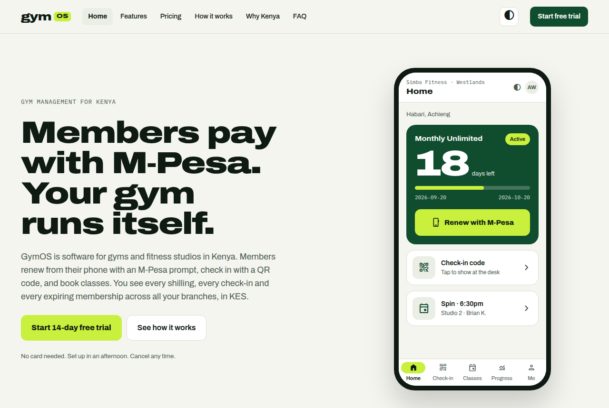
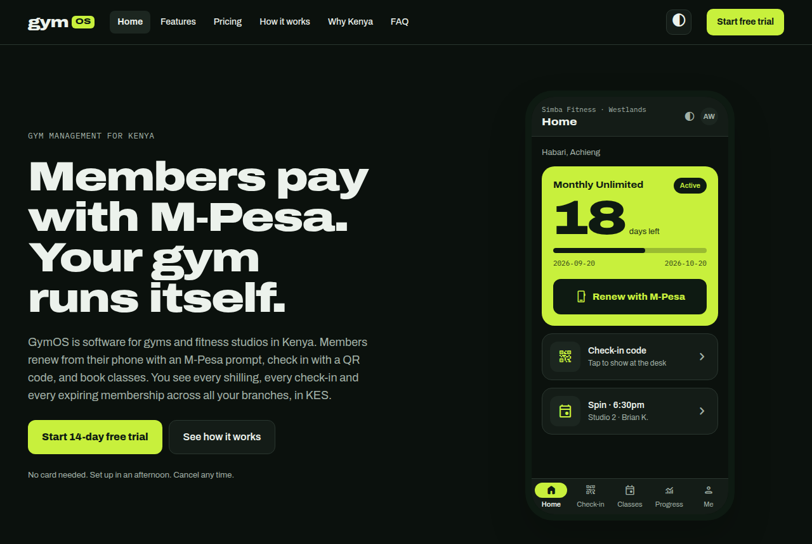

# GymOS Landing

The public marketing site for **GymOS** — gym management software built for
Kenya.

**Live:** https://gymos-chi-eight.vercel.app



## What GymOS is

Most gyms in Kenya already get paid by M‑Pesa. The hard part is everything
after the payment: matching a confirmation SMS to a member, writing it in a
book, remembering who has expired, and chasing renewals one WhatsApp at a time.
Imported gym software doesn't help much — it prices in dollars, assumes card
billing, and treats M‑Pesa as an afterthought.

GymOS starts from the other end. A few of the things that follow from that:

- Members renew from their own phone with an M‑Pesa prompt, and the
  confirmation code lands on the right membership automatically.
- QR check-in at the front desk, from a web app that installs without the Play
  Store.
- Every amount in KES, members signing in with their phone number, and counties
  and receipts that follow Kenyan conventions.

There is more to it than that — the site itself is the better tour.

<details>
<summary>Dark mode</summary>



</details>

## This repo

Just the marketing site. Next.js 16 (App Router), TypeScript and Tailwind v4,
with no backend and no database — every route prerenders as static HTML.

```bash
npm install
npm run dev      # http://localhost:3000
npm run build
npm run lint
```

### Pages

`/` · `/features` · `/pricing` · `/how-it-works` · `/why-kenya` · `/faq` ·
`/start`

### Theming

Light and dark both ship. The theme lives on `<html data-theme>`, persists to
`localStorage` under `gymos-theme`, and is applied by a small inline script
before first paint so a stored dark theme never flashes light — see
`src/lib/theme.ts`.

Colours, type scale, radii and shadows are defined once as tokens in
`src/app/globals.css`, using Tailwind v4's CSS-first config. Breakpoints are
`md` 600, `lg` 1024 and `xl` 1440, plus `dash` 960 and `wide` 1040 for the two
extra thresholds this layout switches on; below 600 is the unprefixed default.

### SEO

`src/app/sitemap.ts` and `src/app/robots.ts` are generated from the same nav
list the header renders, so a new route only has to be added in one place.
Those two and `metadataBase` all read `SITE_URL` from `src/lib/site.ts`, which
resolves in this order:

1. `NEXT_PUBLIC_SITE_URL`, if set
2. the current Vercel production domain
3. `https://gymos.com`

Set `NEXT_PUBLIC_SITE_URL` once the production domain is pointed at the site.

## Deployment

Deployed on **Vercel** from this repo. A move to AWS is planned later; nothing
here is tied to a host beyond the standard Next.js build.

## Notes

- The phone and browser frames on the home page show placeholder UI. They get
  swapped for real screenshots of the member app and the staff dashboard once
  those ship — the frames themselves are already final.
- The form on `/start` has no backend yet. Submitting it shows the confirmation
  state without sending anything.
